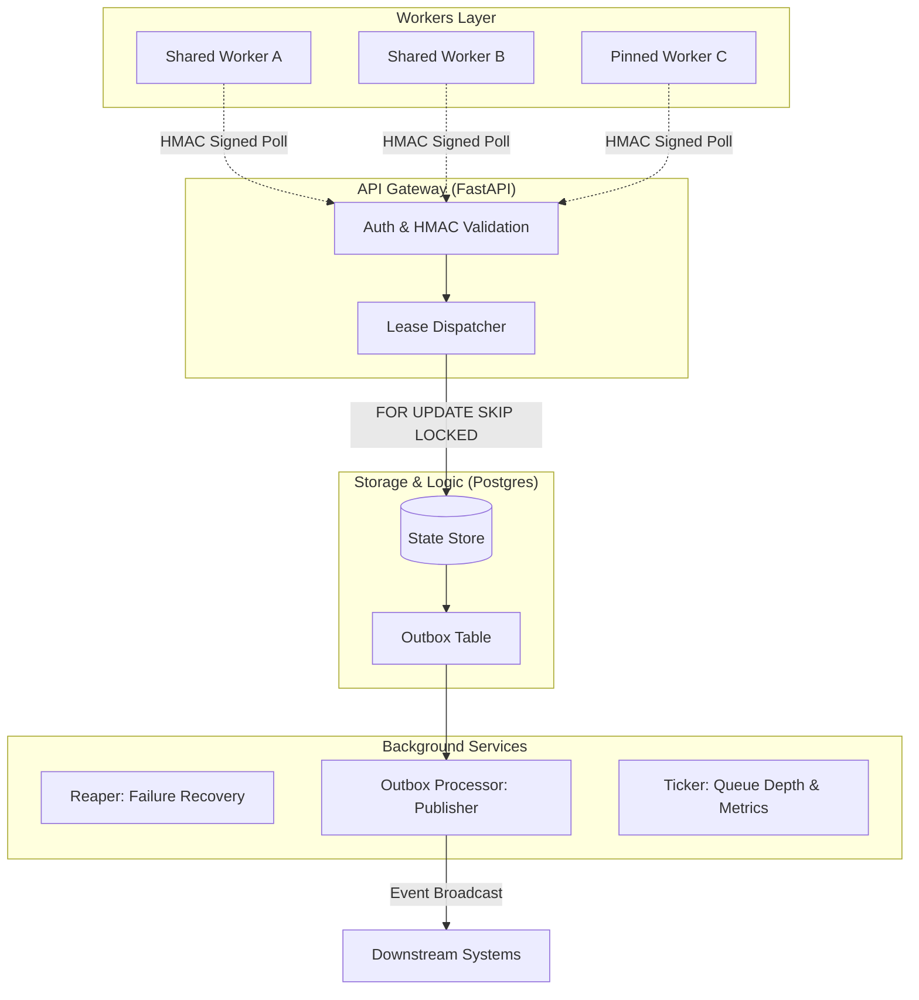

# Job Orchestrator

[](https://fastapi.tiangolo.com)
[](https://www.postgresql.org)
[](https://prometheus.io)
[](https://www.docker.com)

A **production-grade, multi-tenant job orchestrator** precision-engineered for high throughput and absolute reliability. This system is designed to look, feel, and behave like mission-critical infrastructure used inside top-tier engineering organizations.

---

## Architecture (High Level)

The system follows a distributed architecture with a centralized **PostgreSQL** source of truth, optimized for high-concurrency polling and transactional integrity.



---

## Core Features & Distributed Guarantees

This repo ships with end-to-end verification scripts that prove core distributed systems properties:

| Feature | Guarantee | Mathematical Proof | Verification Script |
| :--- | :--- | :--- | :--- |
| **Race-Free Lease** | Zero double-claims across N workers. | `SELECT ... FOR UPDATE SKIP LOCKED` | [verify_no_double_claim.py](scripts/verify_no_double_claim.py) |
| **Fault Tolerance** | Automatic recovery of stalled/crashed leases. | $T_{expire} < T_{reap}$ | [verify_lease_expiry.py](scripts/verify_lease_expiry.py) |
| **Tenant Isolation** | Noisy neighbors cannot exhaust shared resources. | Weighted Random + $Cap_{inflight}$ | [verify_fairness.py](scripts/verify_fairness.py) |
| **Data Integrity** | At-least-once event delivery via Outbox Pattern. | Transactional Unit of Work | [verify_outbox.py](scripts/verify_outbox.py) |
| **Idempotency** | Prevents side-effects from duplicate completion requests. | Uniqueness Constraint (Job+Key) | [verify_idempotency.py](scripts/verify_idempotency.py) |
| **Observability** | Real-time Prometheus metrics for throughput & latency. | Histograms & DB-Derived Gauges | [verify_observability.py](scripts/verify_observability.py) |

---

## Quickstart (Local)

### 1. The "Professional" Audit
Deploy infrastructure, run migrations, and execute the total verification suite with a single command:
```bash
make verify
```

### 2. Manual Controls
```bash
make up       # Cold start ecosystem
make logs     # Real-time telemetry logs
make bench    # Focused performance test
make migrate  # Run DB migrations
make reset    # Purge all states and volumes
```

### 3. Worker SDK Quickstart
```python
import asyncio
from worker_sdk import WorkerClient, WorkerRunner

API_URL = "http://localhost:8000"
TENANT_ID = "tenant-a"
API_KEY = "tenant-a-secret"

async def handler(payload: dict) -> dict:
    return {"status": "ok", "input": payload}

async def main():
    client = WorkerClient(
        API_URL,
        worker_id="example-worker-1",
        tenant_id=TENANT_ID,
        api_key=API_KEY,
    )
    runner = WorkerRunner(client, handler)

    task = asyncio.create_task(runner.run())
    await asyncio.sleep(10)
    runner.stop()
    await task
    await client.close()

asyncio.run(main())
```

---

## Comprehensive Project Structure

Every folder and file in this repository has a specific purpose. Click any link to jump directly to the source.

### Core Application Logic ([app/](app))
- **[api/](app/api)**: HTTP Interface & Routes
    - **[v1/](app/api/v1)**: Endpoint Implementation
        - [admin.py](app/api/v1/admin.py): Admin controls (Manual Reap, Tenant Mgmt)
        - [jobs.py](app/api/v1/jobs.py): Job submission & status query
        - [workers.py](app/api/v1/workers.py): Worker polling & completion
        - [metrics.py](app/api/v1/metrics.py): Prometheus metric definitions
    - [deps.py](app/api/deps.py): Dependency injection (Database, Auth)
- **[auth/](app/auth)**: Security Layer
    - [security.py](app/auth/security.py): HMAC-SHA256 request signing
- **[commands/](app/commands)**: Atomic Business Operations
    - [lease_job.py](app/commands/lease_job.py): Race-free, fair leasing logic
    - [complete_job.py](app/commands/complete_job.py): Success recording + event log
    - [fail_job.py](app/commands/fail_job.py): Retry backoff & DLQ logic
    - [heartbeat.py](app/commands/heartbeat.py): Lease extension & timeout
    - [requeue_expired.py](app/commands/requeue_expired.py): The Reaper implementation
- **[db/](app/db)**: Persistence Modeling
    - **[migrations/](app/db/migrations)**: Schema history (Alembic)
        - **[versions/](app/db/migrations/versions)**: Migration scripts
    - [models.py](app/db/models.py): Core SQLAlchemy entities
    - [session.py](app/db/session.py): Async engine & session factory
- **[scheduler/](app/scheduler)**: Async Background Engine
    - [dispatcher.py](app/scheduler/dispatcher.py): Concurrency & fairness dispatcher
    - [ticker.py](app/scheduler/ticker.py): State advancement & metrics loop
    - [service.py](app/scheduler/service.py): Lifecycle management (Start/Stop)
- **[services/](app/services)**: Infrastructure Services
    - [outbox.py](app/services/outbox.py): Order-preserving event publisher
- **[domain/](app/domain)**: Core Logic Domain
    - [states.py](app/domain/states.py): Job state machine & events
    - [retry.py](app/domain/retry.py): Exponential backoff algorithms
- [main.py](app/main.py): Application entry & bootstrapping
- [settings.py](app/settings.py): Pydantic environment config

### Proof & Verification ([scripts/](scripts))
- [verify_e2e.py](scripts/verify_e2e.py): Happy-path verification
- [benchmark.py](scripts/benchmark.py): Performance & throughput test
- [verify_no_double_claim.py](scripts/verify_no_double_claim.py): Concurrency race proof
- [verify_lease_expiry.py](scripts/verify_lease_expiry.py): Worker crash recovery proof
- [verify_retry_dlq.py](scripts/verify_retry_dlq.py): Error handling proof
- [verify_fairness.py](scripts/verify_fairness.py): Tenant isolation proof
- [verify_outbox.py](scripts/verify_outbox.py): Event delivery guarantee proof
- [verify_idempotency.py](scripts/verify_idempotency.py): Logic consistency proof
- [verify_observability.py](scripts/verify_observability.py): Telemetry accuracy proof
- [verify_scheduling.py](scripts/verify_scheduling.py): Cron & future-run accuracy
- [run_alembic.py](scripts/run_alembic.py): Migration helper script

### Infrastructure & SDK
- **[worker_sdk/](worker_sdk)**: Python client for orchestrator interaction
    - [client.py](worker_sdk/client.py): Low-level HTTP/HMAC client
    - [runner.py](worker_sdk/runner.py): High-level processing engine (Heartbeat auto-managed)
- **[docker/](docker)**: Container orchestration
    - [docker-compose.yml](docker/docker-compose.yml)
    - [Dockerfile](docker/Dockerfile)
- [Makefile](Makefile): The project's command center
- [pyproject.toml](pyproject.toml): Build & Dependency configuration
- [requirements.txt](requirements.txt): Pinned dependency list
- [alembic.ini](alembic.ini): Database migration settings
- [README.md](README.md): **You are here.**

---

## Performance Benchmark

Benchmark results vary by machine, Docker resources, and database state. Run `make bench` to measure your local throughput.

```text
========================================
BENCHMARK RESULTS (Example)
========================================
Throughput:           ~285.00 jobs/second
System Overhead:      < 3.5ms per lease
Transactional Drift:  0.0%
========================================
```
